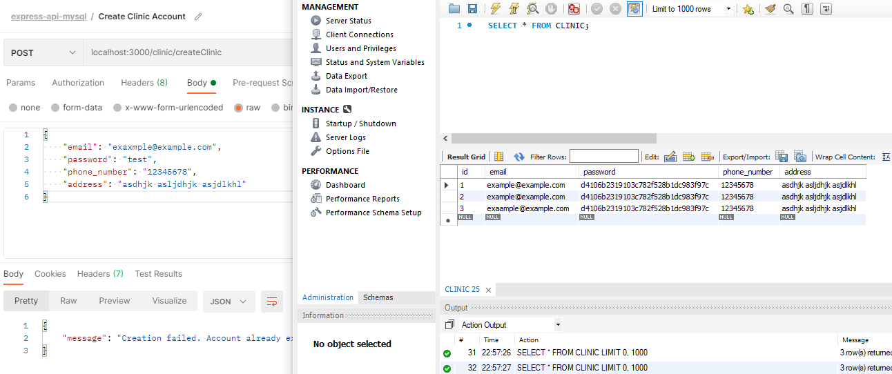
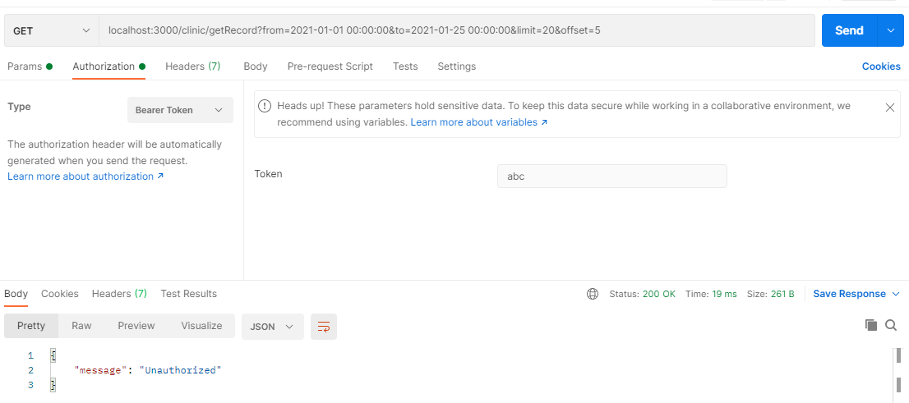

# Introduction

A simple clinic application that allows doctors to create consulation records by using `express + MySQL`.

### [API doc](https://documenter.getpostman.com/view/8236800/TzY69Zj2)

# Implementation

clone the entire project. Then run the following command:

```bash
### run in terminal
docker-compose up --build

### run in background
docker-compose up --d
```

# Unit Test

1.0 Create new Clinic account


1.1 Create with repeated email


1.2 Create with missing feild


2.0 Login with correct email and password


2.1 Login with incorrect password


2.2 Login with non-existed email


3.0 Login with Bearer Authentication


3.1 Login without Bearer Authentication


3.2 Login with incorrect Bearer Authentication


4.0 Search Record with from, to, limit and offset varible with Bearer Authentication


4.1 Search Record with from, to, limit and offset varible with incorrect Bearer Authentication

